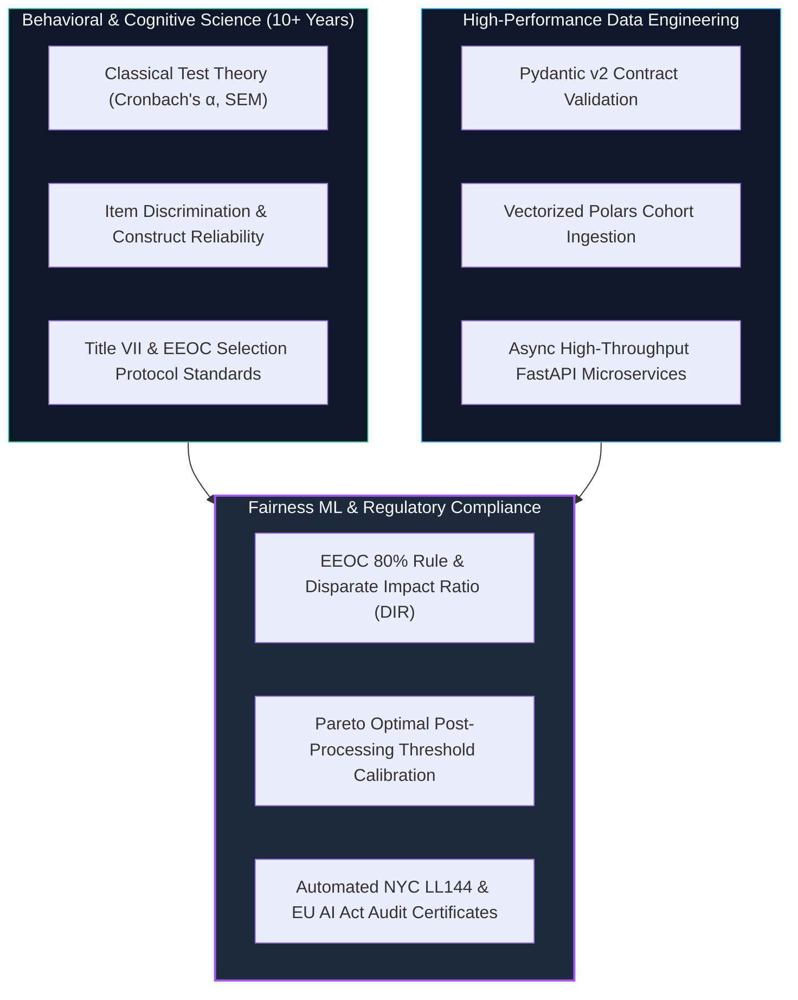
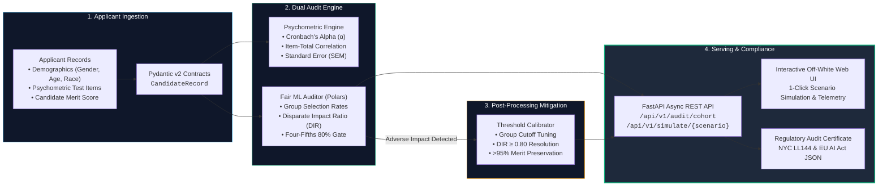

# FairTalent-Engine ⚖️⚡

[](https://github.com/neurodeveloper11/fairtalent-engine/actions)
[](https://python.org)
[](https://fastapi.tiangolo.com)
[](https://pydantic.dev)
[](https://pola.rs)
[](https://www.docker.com)
[](tests/)
[](#)
[](LICENSE)

An enterprise-grade, high-throughput **Fair Machine Learning (Fair ML)** auditing pipeline and psychometric integrity engine designed for AI-assisted talent acquisition. 

Audits automated recruitment systems against the **EEOC Four-Fifths Rule (29 CFR § 1607.4(D))**, **NYC Local Law 144 (AEDT Bias Audits)**, and **EU AI Act Annex III (High-Risk AI in Employment)**, coupling Classical Test Theory construct validation ($\alpha \ge 0.70$) with automated Pareto threshold mitigation.

Designed and engineered by **[Fabio Torres](https://github.com/neurodeveloper11)** (M.Sc. in Data Engineering & Cloud Infrastructure • 10+ Years Behavioral & Cognitive Psychology Leadership).

---

## 🧠 The Domain Moat: "Del Diván al Dato"

In automated recruitment and talent acquisition (HRTech), large-scale machine learning filters and ATS screening models routinely introduce latent discrimination against protected demographic groups (gender, age, ethnicity). Traditional algorithmic solutions fail because:

1. **Software Engineers and Data Scientists** know how to deploy XGBoost or vector databases, but **do not understand psychometric construct validity, Classical Test Theory (CTT), item discrimination ($r_{bis}$), or federal employment law standards**.
2. **HR Practitioners and Industrial Psychologists** understand Title VII and test administration, but **cannot engineer distributed Polars pipelines, write vectorized async APIs, or automate post-processing mitigation algorithms**.

**FairTalent-Engine** bridges this chasm:



---

## 🏗️ System Architecture & Event Flow



---

## 📐 Mathematical & Regulatory Foundations

### 1. EEOC Four-Fifths Rule (Disparate Impact Ratio)
Under **29 CFR § 1607.4(D)**, if the selection rate of a protected demographic group is less than 80% (4/5ths) of the highest selecting group, the selection tool possesses **Adverse Impact**:

$$\text{DIR} = \frac{\text{Selection Rate}_{\text{Minority Group}}}{\text{Selection Rate}_{\text{Reference Group}}} \ge 0.80$$

If $\text{DIR} < 0.80$, the system generates a **Critical Legal Violation** warning.

### 2. Psychometric Construct Reliability (Cronbach's Alpha)
Under Title VII employment litigation, an employer cannot defend a selection test unless it demonstrates proven construct validity:

$$\alpha = \frac{K}{K - 1} \left( 1 - \frac{\sum_{i=1}^K \sigma_i^2}{\sigma_X^2} \right)$$

Where $K$ is the item count, $\sigma_i^2$ is individual item variance, and $\sigma_X^2$ is aggregate test score variance. Baseline regulatory validity requires $\alpha \ge 0.70$.

### 3. Standard Error of Measurement ($SEM$)
Quantifies score uncertainty around decision cutoffs:

$$SEM = \sigma_X \sqrt{1 - \alpha}$$

---

## 🚀 Live Interactive Dashboard

The engine includes a zero-dependency, executive **Off-White / Dark Mode Dashboard** served directly at `GET /`:

* **1-Click Benchmark Cohort Simulation:**
  * `Biased Tech ATS`: Simulates uncalibrated resume parsers penalizing female technical candidates ($\text{DIR} \approx 0.46$).
  * `Executive Leadership Screening`: Simulates automated tests penalizing candidates $\ge 40$ years old (ADEA violation).
  * `Calibrated Pipeline`: Demonstrates full compliance across all demographic categories.
* **Interactive Cutoff Slider:** Adjust selection cutoffs in real time ($50.0$ to $92.0$) and watch adverse impact ratios and selection rates update dynamically.
* **Automated Fair-ML Mitigation Button:** Automatically computes group-specific cutoffs to resolve the EEOC violation while retaining over $95\%$ of original talent merit.
* **Audit Certificate Exporter:** Generates an official, structured compliance certificate aligned with NYC Local Law 144 and EU AI Act Annex III standards.

---

## 🔌 API Reference & Endpoints

| Method | Endpoint | Description |
| :--- | :--- | :--- |
| `GET` | `/` | Serves the interactive executive web dashboard |
| `GET` | `/health` | System health check and regulatory framework status |
| `GET` | `/api/v1/simulate/{scenario}` | Simulates and audits a synthetic cohort (`biased_tech_ats`, `age_penalized_exec`, `compliant_fair_pipeline`) |
| `POST` | `/api/v1/audit/cohort` | Audits an uploaded batch of candidate records |
| `POST` | `/api/v1/mitigate` | Executes Pareto threshold calibration to eliminate adverse impact |
| `GET` | `/api/v1/compliance/certificate` | Generates a certified audit trail payload for legal compliance officers |

Interactive OpenAPI documentation is available at `/docs` (Swagger) and `/redoc`.

---

## 🛠️ Quickstart Guide

### 1. Local Setup
```bash
# Clone repository
git clone https://github.com/neurodeveloper11/fairtalent-engine.git
cd fairtalent-engine

# Install dependencies
pip install -r requirements.txt

# Run test suite (100% pass)
python -m pytest -v tests/

# Launch development server
uvicorn src.main:app --host 0.0.0.0 --port 8000 --reload
```

Visit `http://localhost:8000` for the dashboard and `http://localhost:8000/docs` for the interactive API explorer.

### 2. Docker Deployment
```bash
# Build and launch with Docker Compose
docker-compose up --build -d

# Check health status
curl http://localhost:8000/health
```

---

## 🧪 Testing & Validation Suite

The test suite covers psychometric accuracy, boundary edge cases, regulatory thresholds, and API handlers:

```bash
python -m pytest -v tests/
```

Test coverage includes:
* `test_psychometrics.py`: Verification of Cronbach's alpha, item discrimination, zero-variance handling, and Sten conversions.
* `test_fairness_auditor.py`: EEOC 80% rule validation, adverse impact detection, and regulatory synthesis.
* `test_mitigation.py`: Post-processing Pareto threshold tuning, merit score retention, and DIR resolution.
* `test_generator.py`: Deterministic synthetic cohort generation across standard hiring scenarios.
* `test_api.py`: FastAPI endpoints, error handling, contract validation, and certificate generation.

---

## 📄 License & Intellectual Property

Distributed under the **MIT License**. See `LICENSE` for details.

*All applicant cohorts, candidate names, and simulation figures are 100% synthetic, generated for algorithmic demonstration and benchmark testing.*
